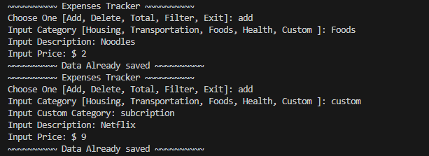
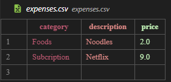

# **The Expenses Tracker**
#### The Expenses Tracker is a Command-Line Interface project built for user to maintain their expenses. This project work by creating csv file named "expenses.csv" that has 3 header (Category, Description, Price)
 
#### Feature:
- Category :
  - Housing
  - Trasnportation
  - Foods
  - Health 
  - Custom by user
- Description : Specific Objects name
- Price 
- Delete Rows
- Total Price
- Filtering by Category

#### How to Run:
- Run with IDE : python expenses_track.py  
** Don't need to install any library  

